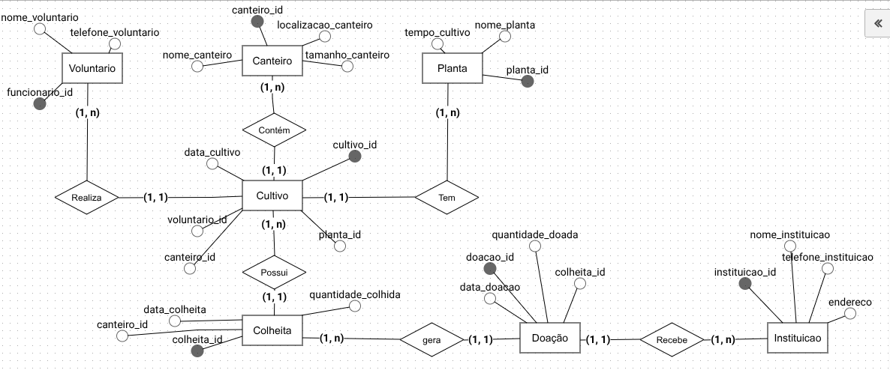
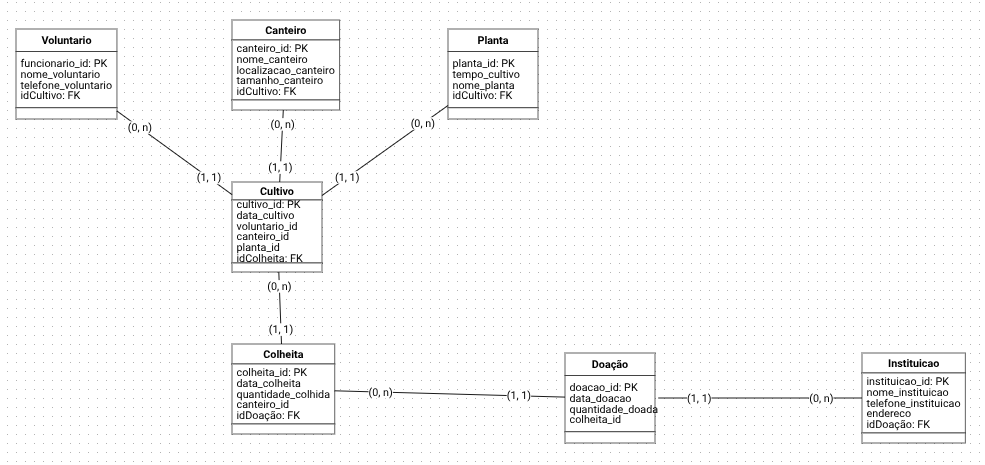
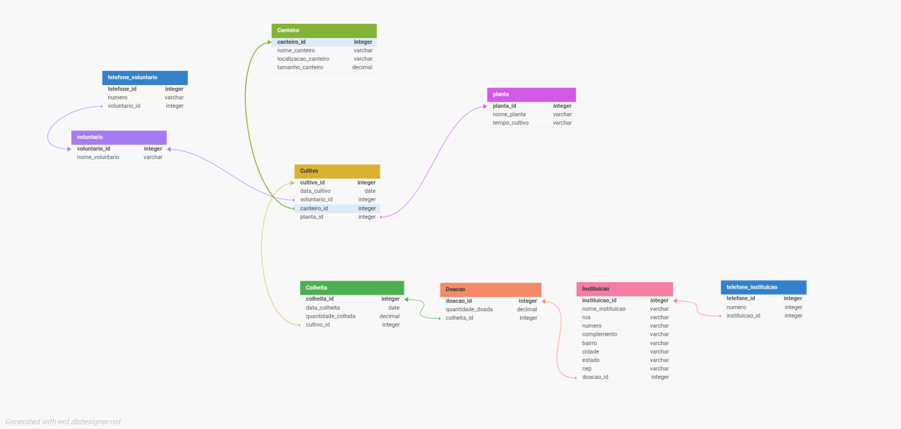

# 🌿 VerdeViva — Sistema de Horta Comunitária

O **VerdeViva** é um projeto de **banco de dados relacional** desenvolvido para gerenciar as atividades de uma **horta comunitária**.  
Ele abrange todo o ciclo da produção: desde o **plantio e cultivo** até a **colheita e doação dos alimentos** para instituições parceiras.

---

## 🧠 Visão Geral do Projeto

O sistema foi projetado para registrar e organizar informações sobre:

- **Plantas** cultivadas na horta.
- **Canteiros** disponíveis e suas características.
- **Cultivos** realizados (qual planta, onde e quando).
- **Voluntários** responsáveis pelas atividades.
- **Colheitas** de cada cultivo.
- **Doações** feitas com os produtos colhidos.
- **Instituições** que recebem as doações.

Essa modelagem garante:

- Rastreamento completo do ciclo de vida de cada cultivo.
- Histórico de colheitas e doações.
- Transparência e organização nas ações da horta comunitária.

---

## 🧩 Modelo Entidade-Relacionamento (MER)

**Entidades principais e suas funções:**

| Entidade        | Descrição                                                                 |
| --------------- | ------------------------------------------------------------------------- |
| **Planta**      | Armazena informações sobre os tipos de plantas cultivadas.                |
| **Canteiro**    | Representa o espaço físico onde ocorre o cultivo.                         |
| **Cultivo**     | Liga uma planta a um canteiro e registra o período de cultivo.            |
| **Voluntário**  | Representa os participantes da horta.                                     |
| **Colheita**    | Registra as colheitas de cada cultivo, incluindo data e quantidade.       |
| **Doação**      | Registra as doações feitas, associando colheitas a instituições.          |
| **Instituição** | Representa entidades que recebem as doações (ex: escolas, abrigos, ONGs). |

### Diagrama da modelagem Conceitual

Foi utilizado o brmodelo para fazer a modelagem conceitual do mini mundo.



---

## Modelo Lógico



### 🌾 Relacionamento Ternário — Planta, Canteiro e Voluntário

No modelo lógico do VerdeViva, a tabela cultivo representa um relacionamento ternário, ou seja, uma associação que envolve três entidades ao mesmo tempo: planta, canteiro e voluntário.

Esse tipo de relacionamento é utilizado quando uma única entidade associativa precisa conectar três outras entidades de forma significativa, sem que seja possível dividi-la em dois relacionamentos binários sem perda de informação.

No contexto da horta comunitária:

- Um voluntário realiza o cultivo de uma determinada planta em um canteiro específico.

Assim, a tabela cultivo funciona como um elo que registra:

- Qual planta está sendo cultivada (planta_id);

- Em qual canteiro o cultivo está ocorrendo (canteiro_id);

- Qual voluntário está responsável por esse cultivo (voluntario_id);

- Além de atributos próprios, como a data de início do cultivo (data_cultivo).

Essa estrutura permite representar de forma precisa a relação entre os três elementos centrais do sistema, garantindo:

- Rastreabilidade das atividades realizadas por cada voluntário;

- Histórico completo dos cultivos de cada planta e canteiro;

- Integridade referencial, já que a tabela cultivo depende das chaves primárias de planta, canteiro e voluntário.

Em resumo, o relacionamento ternário do cultivo expressa o coração do sistema VerdeViva, conectando pessoas, plantas e espaços — refletindo o funcionamento real de uma horta comunitária colaborativa.


[Acesse o diagrama aqui](https://dbdesigner.page.link/715ongNyacDuKL1z5)
---

## 🗃️ Estrutura das Tabelas (modelo SQL simplificado)

```sql
CREATE DATABASE IF NOT EXISTS horta_comunitaria;
USE horta_comunitaria;

-- cria tabela voluntario
CREATE TABLE voluntario (
    voluntario_id INT PRIMARY KEY AUTO_INCREMENT,
    nome_voluntario VARCHAR(100) NOT NULL
) ENGINE=InnoDB DEFAULT CHARSET=utf8mb4 COLLATE=utf8mb4_unicode_ci;

ALTER TABLE voluntario ADD COLUMN funcao VARCHAR(50);

-- cria tabela telefone_usuario
CREATE TABLE telefone_usuario (
    telefone_id INT PRIMARY KEY AUTO_INCREMENT,
    numero VARCHAR(11) NOT NULL,
    voluntario_id INT NOT NULL,
    CONSTRAINT fk_telefone_voluntario
        FOREIGN KEY (voluntario_id)
        REFERENCES voluntario(voluntario_id)
        ON DELETE CASCADE
        ON UPDATE CASCADE
);

-- cria tabela canteiro
CREATE TABLE canteiro (
    canteiro_id INT PRIMARY KEY AUTO_INCREMENT,
    nome_canteiro VARCHAR(100) NOT NULL,
    localizacao_canteiro VARCHAR(100) NOT NULL,
    tamanho_canteiro DECIMAL(8,2) NOT NULL
);


-- cria tabela planta

CREATE TABLE planta (
    planta_id INT PRIMARY KEY AUTO_INCREMENT,
    nome_planta VARCHAR(100),
    tempo_cultivo VARCHAR(50)
);

-- cria tabela cultivo
CREATE TABLE cultivo (
    cultivo_id INT PRIMARY KEY AUTO_INCREMENT,
    data_cultivo DATE NOT NULL,
    voluntario_id INT NOT NULL,
    canteiro_id INT NOT NULL,
    planta_id INT NOT NULL,
    CONSTRAINT fk_cultivo_voluntario
        FOREIGN KEY (voluntario_id)
        REFERENCES voluntario(voluntario_id)
        ON DELETE CASCADE
        ON UPDATE CASCADE,
    CONSTRAINT fk_cultivo_canteiro
        FOREIGN KEY (canteiro_id)
        REFERENCES canteiro(canteiro_id)
        ON DELETE CASCADE
        ON UPDATE CASCADE,
    CONSTRAINT fk_cultivo_planta
        FOREIGN KEY (planta_id)
        REFERENCES planta(planta_id)
        ON DELETE CASCADE
        ON UPDATE CASCADE
);

-- cria tabela colheita
CREATE TABLE colheita (
    colheita_id INT PRIMARY KEY AUTO_INCREMENT,
    data_colheita DATE NOT NULL,
    quantidade_colhida DECIMAL(8,2) NOT NULL,
    cultivo_id INT NOT NULL,
    CONSTRAINT fk_colheita_cultivo
        FOREIGN KEY (cultivo_id)
        REFERENCES cultivo(cultivo_id)
        ON DELETE CASCADE
        ON UPDATE CASCADE
);

-- cria tabela instituicao
CREATE TABLE instituicao (
    instituicao_id INT PRIMARY KEY AUTO_INCREMENT,
    nome_instituicao VARCHAR(100) NOT NULL,
    rua VARCHAR(50) NOT NULL,
    numero VARCHAR(5) NOT NULL,
    complemento VARCHAR(50),
    bairro VARCHAR(50) NOT NULL,
    cidade VARCHAR(100) NOT NULL,
    estado VARCHAR(2) NOT NULL,
    cep VARCHAR(8) NOT NULL
);

-- cria tabela doacao
CREATE TABLE doacao (
    doacao_id INT PRIMARY KEY AUTO_INCREMENT,
    quantidade_doada DECIMAL(8,2) NOT NULL,
    colheita_id INT NOT NULL,
    instituicao_id INT NOT NULL,
    CONSTRAINT fk_doacao_colheita
        FOREIGN KEY (colheita_id)
        REFERENCES colheita(colheita_id)
        ON DELETE CASCADE
        ON UPDATE CASCADE,
    CONSTRAINT fk_doacao_instituicao
        FOREIGN KEY (instituicao_id)
        REFERENCES instituicao(instituicao_id)
        ON DELETE CASCADE
        ON UPDATE CASCADE
);

-- cria tabela telefone_instituicao
CREATE TABLE telefone_instituicao (
    telefone_id INT PRIMARY KEY AUTO_INCREMENT,
    numero VARCHAR(11) NOT NULL,
    instituicao_id INT NOT NULL,
    CONSTRAINT fk_telefone_instituicao
        FOREIGN KEY (instituicao_id)
        REFERENCES instituicao(instituicao_id)
        ON DELETE CASCADE
        ON UPDATE CASCADE
);
```

## Inserts

```sql

-- voluntário
INSERT INTO voluntario (nome_voluntario, funcao)
VALUES ('Camilla Barros', 'agricultor');

-- telefone_voluntario
INSERT INTO telefone_usuario (numero, voluntario_id)
VALUES ('11987654321', 1);

-- canteiro
INSERT INTO canteiro (nome_canteiro, localizacao_canteiro, tamanho_canteiro)
VALUES ('Canteiro Central', 'Área principal da horta', 20.5),

-- planta
INSERT INTO planta (nome_planta, tempo_cultivo)
VALUES ('Alface', '30 dias');

-- cultivo
INSERT INTO cultivo (data_cultivo, voluntario_id, canteiro_id, planta_id)
VALUES ('2025-11-01', 1, 1, 1);

-- colheita
INSERT INTO colheita (data_colheita, quantidade_colhida, cultivo_id)
VALUES ('2025-11-30', 5.0, 1);

-- instituicao
INSERT INTO instituicao (nome_instituicao, rua, numero, complemento, bairro, cidade, estado, cep)
VALUES ('Asilo Feliz', 'Rua das Flores', '123', '', 'Centro', 'São Paulo', 'SP', '01001000');

-- telefone_instituicao
INSERT INTO telefone_instituicao (numero, instituicao_id)
VALUES ('11999998888', 1),

-- doacao
INSERT INTO doacao (quantidade_doada, colheita_id, instituicao_id)
VALUES (5.0, 1, 1);

```
